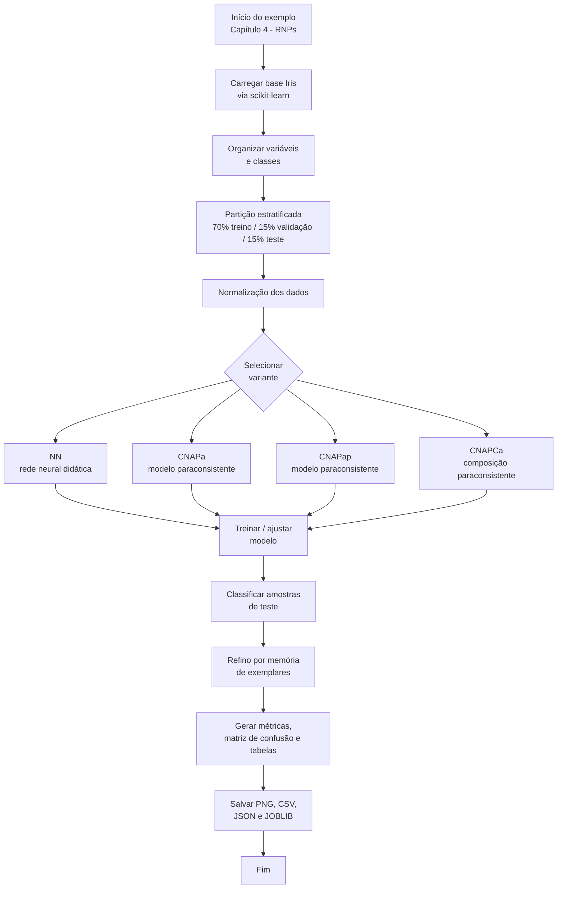
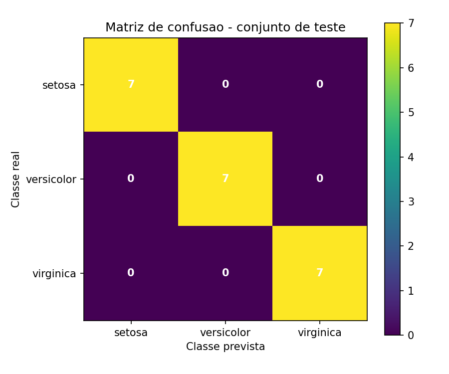

# Livro Aplicações de LPA2v — Capítulo 4: RNPs em Python para Classificação Iris

Implementação em Python do exemplo prático do **Capítulo 4 — RNPs (Redes Neurais Paraconsistentes)** do livro **Aplicações de LPA2v**.

Este repositório reúne quatro variantes didáticas aplicadas à base **Iris**:

- **NN** — rede neural didática convencional, usada como referência comparativa;
- **CNAPa** — célula neural artificial paraconsistente de aprendizagem;
- **CNAPap** — arquitetura paraconsistente aplicada ao problema Iris;
- **CNAPCa** — composição paraconsistente aplicada às quatro variáveis da flor Iris.

O objetivo é permitir que o leitor execute, compare e estude as diferenças práticas entre uma rede neural didática e modelos baseados em LPA2v/RNPs, usando um problema clássico de classificação supervisionada.

---

## Visão geral

O projeto foi organizado como um repositório individual dentro da coleção de exemplos do livro, seguindo a convenção:

```text
livro-aplic-lpa2v-capXX-nome-do-exemplo-tecnologia
```

Nome sugerido deste repositório:

```text
livro-aplic-lpa2v-cap04-rnps-iris-python
```

Diferentemente do exemplo do Robô Emmy do Capítulo 1, este exemplo **não é dividido em partes**. Por isso, o nome do repositório não utiliza `parte1`, `parte2` ou `parte-unica`.

---

## Objetivo do exemplo

Este exemplo mostra como aplicar arquiteturas didáticas de redes neurais e redes neurais paraconsistentes ao problema de classificação de flores Iris. O fluxo comum das variantes é:

1. carregar a base Iris pelo `scikit-learn`;
2. separar os dados em treino, validação e teste por partição estratificada manual;
3. normalizar as variáveis de entrada;
4. treinar ou construir o modelo da respectiva variante;
5. classificar as amostras de teste;
6. gerar resultados em CSV, JSON, JOBLIB e PNG;
7. aplicar refino final por memória de exemplares 1-NN com treino + validação, quando previsto no script.

---

## Diagrama geral do fluxo do exemplo



---

## Como interpretar o exemplo

### 1. Variante NN

A pasta `NN/` contém uma rede neural didática com camada oculta e saída softmax. Ela funciona como referência comparativa para observar o comportamento de uma rede neural convencional no mesmo problema usado pelas variantes paraconsistentes.

### 2. Variante CNAPa

A pasta `CNAPa/` contém uma implementação didática de uma célula neural artificial paraconsistente aplicada à classificação Iris. A classificação é construída a partir de graus de evidência normalizados e regras compatíveis com a LPA2v.

### 3. Variante CNAPap

A pasta `CNAPap/` contém uma versão paraconsistente didática voltada ao mesmo problema, com estrutura própria de cálculo, validação e geração de resultados. Ela permite comparar mudanças de arquitetura e desempenho em relação à CNAPa.

### 4. Variante CNAPCa

A pasta `CNAPCa/` trabalha a composição paraconsistente das evidências associadas às quatro variáveis da Iris: comprimento da sépala, largura da sépala, comprimento da pétala e largura da pétala.

---

## Estrutura do repositório

```text
.
├── .github/
│   └── workflows/
│       └── python-check.yml
├── CNAPa/
├── CNAPap/
├── CNAPCa/
├── NN/
├── docs/
│   ├── book-context.md
│   ├── execution-guide.md
│   ├── project-overview.md
│   └── repository-structure.md
├── .gitattributes
├── .gitignore
├── CHANGELOG.md
├── CITATION.cff
├── CODE_OF_CONDUCT.md
├── CONTRIBUTING.md
├── IMPORTAR_NO_GITHUB.md
├── LICENSE
├── README.md
├── requirements.txt
├── run_all_examples.py
└── SECURITY.md
```

---

## Requisitos

Recomendação: usar Python 3.10 ou superior.

Instale as dependências com:

```bash
pip install -r requirements.txt
```

Dependências principais:

- `numpy`
- `pandas`
- `scikit-learn`
- `matplotlib`
- `joblib`

---

## Como executar todos os exemplos

Na raiz do repositório, execute:

```bash
python run_all_examples.py
```

Esse script chama, em sequência, os quatro programas principais:

```text
NN/main_iris_nn_didatico.py
CNAPa/main_iris_cnapa_didatico.py
CNAPap/main_iris_cnapap_didatico_v2_autocontido.py
CNAPCa/main_iris_cnapca_didatico_autocontido.py
```

---

## Como executar cada variante separadamente

### NN

```bash
python NN/main_iris_nn_didatico.py
```

### CNAPa

```bash
python CNAPa/main_iris_cnapa_didatico.py
```

### CNAPap

```bash
python CNAPap/main_iris_cnapap_didatico_v2_autocontido.py
```

### CNAPCa

```bash
python CNAPCa/main_iris_cnapca_didatico_autocontido.py
```

---

## Principais saídas geradas

Cada variante salva, em sua própria pasta, arquivos como:

- figuras `PNG` com distribuição das classes, subconjuntos, visualização 3D, matriz de confusão e desempenho;
- tabelas `CSV` com resultados, partições e protótipos;
- arquivos `JSON` com resumo estruturado dos resultados;
- arquivos `JOBLIB` com o modelo salvo.

Exemplo de saídas esperadas:

```text
05_matriz_confusao_teste_*.png
06_desempenho_treinamento_*.png
resultado_iris_*_didatico.csv
resultado_iris_*_didatico.json
modelo_iris_*_didatico.joblib
```

---

## Imagens de resultado

### NN


### CNAPa


### CNAPap



### CNAPCa


---

## Relação com o livro

Este repositório corresponde a um exemplo prático individual do **Capítulo 4 — RNPs** do livro **Aplicações de LPA2v**. A intenção é manter o exemplo isolado, reutilizável e versionável, facilitando a citação no livro, o acesso do leitor e a evolução futura do código.

---

## Licença

Consulte o arquivo `LICENSE`.

---

## Citação

Se este repositório for usado em material acadêmico, consulte o arquivo `CITATION.cff`.
